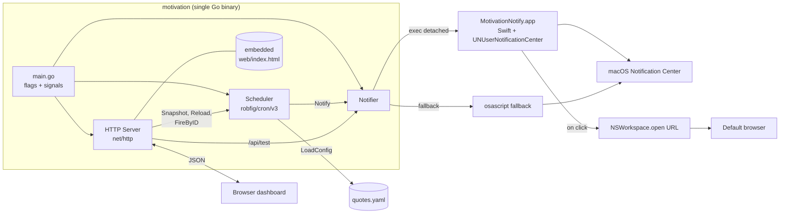
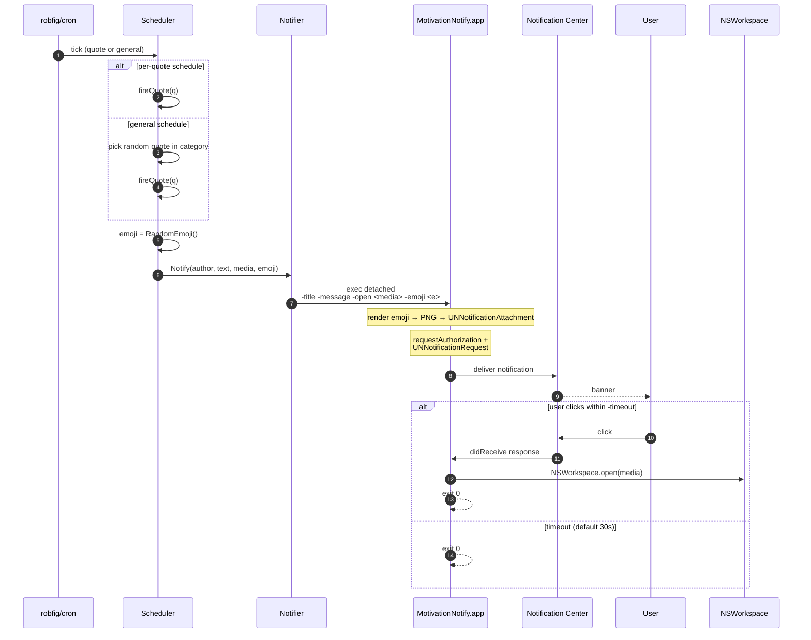
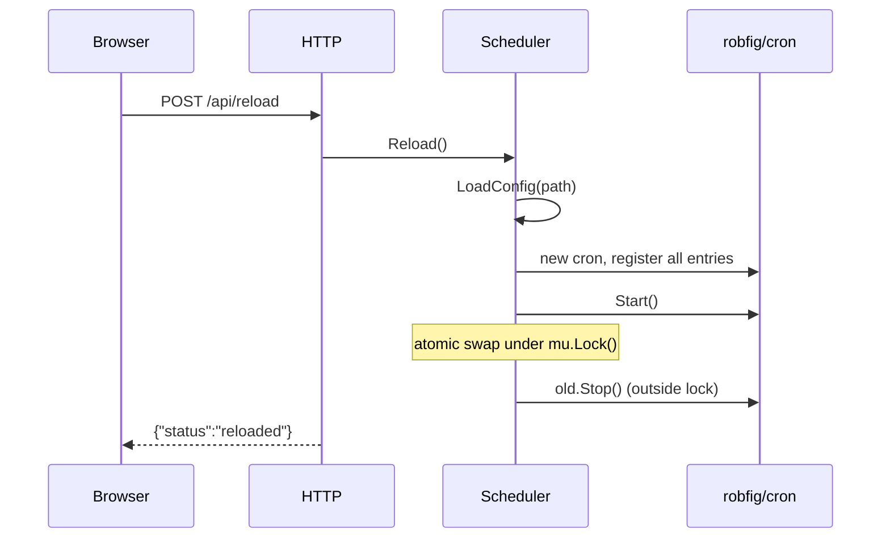
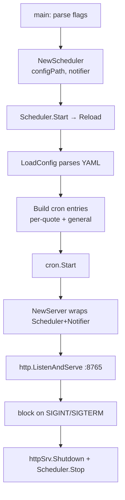

# Architecture

A single Go process hosts three collaborating pieces: a **Scheduler** running cron jobs, a **Notifier** that delegates to a sidecar Swift helper (`MotivationNotify.app`) for macOS Notification Center delivery, and an **HTTP Server** that exposes a small embedded dashboard. State lives entirely in memory; the YAML file is the only persistence.

The helper is a separate `.app` bundle (with its own `CFBundleIdentifier`) because `UNUserNotificationCenter` — the only API that reliably delivers notifications on macOS 13+/Tahoe — refuses to deliver from unregistered bare executables.

## Component diagram

## Fire-a-quote sequence

## Reload sequence

## Data flow at startup

## Design choices

- **In-process scheduler.** Avoids external dependencies; trivially restartable.
- **Atomic Reload.** A new `cron.Cron` is built and swapped under a mutex so in-flight HTTP requests never see a half-loaded state.
- **`cron.EntryID` lookup, not slice index.** `cron.Entries()` returns sorted by next-run, so we store IDs and look up `Next` per entry to keep UI mapping correct.
- **Sidecar Swift helper, not a third-party CLI.** `terminal-notifier` is broken on macOS Tahoe (uses deprecated `NSUserNotification`; click handler silently drops or activates the wrong process). `alerter` is only available via third-party Homebrew taps. So the daemon ships its own minimal Swift helper (`notify-helper/main.swift`) packaged as `MotivationNotify.app` with its own bundle id `com.motivation.notifier`. The `.app` wrapper + ad-hoc codesign are required for `UNUserNotificationCenter` to register the helper with Notification Center.
- **Helper is invoked detached, one process per notification.** The Go side calls `cmd.Start()` (not `Run()`) so the helper outlives the call. Each helper runs its own main `RunLoop` waiting up to `-timeout` seconds (default 30) for a click, then exits. On click it opens the `-open` URL itself via `NSWorkspace.shared.open`. Multiple in-flight notifications are fully independent processes.
- **First-run consent prompt.** macOS shows the standard "MotivationNotify wants to send notifications" dialog the first time the helper runs. This is the trade-off for being on the modern, working API.
- **osascript fallback.** If the helper is missing, the notifier falls back to `osascript display notification` (no click-to-open) and logs a one-shot warning pointing at `make helper`.
- **Loopback only.** HTTP binds `127.0.0.1` by default — no auth, single-user laptop tool.
- **YAML is the only state.** Reload re-reads the file; no internal DB.
- **Random emoji as the notification icon — best effort.** Each fire picks one from `emojis.go` and passes it through `Notify(..., emoji)`. The Swift helper renders the emoji to a 512×512 transparent PNG and then (a) overwrites `MotivationNotify.app/Contents/Resources/AppIcon.png` + touches the bundle so Notification Center re-reads the **left-side app icon**, (b) sets `NSApp.applicationIconImage` on the live process as a backup, and (c) attaches the PNG as a `UNNotificationAttachment` so it also appears as the **right-side thumbnail**. macOS caches per-bundle-id notification icons aggressively, so the very first fire after a swap can still show a stale icon; subsequent fires typically pick up the new file. If macOS refuses to refresh, a `killall NotificationCenter` (or restart) flushes it.
