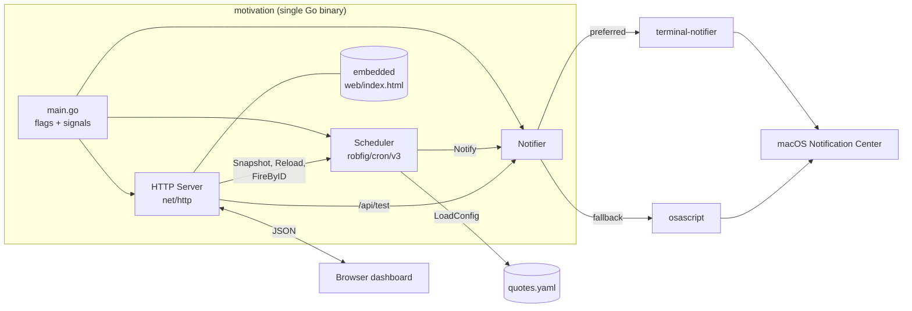
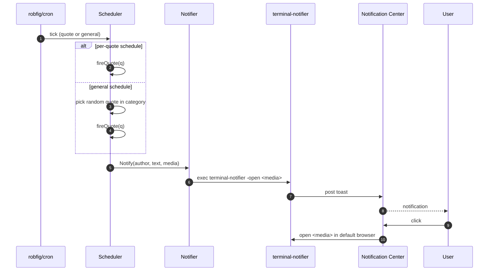
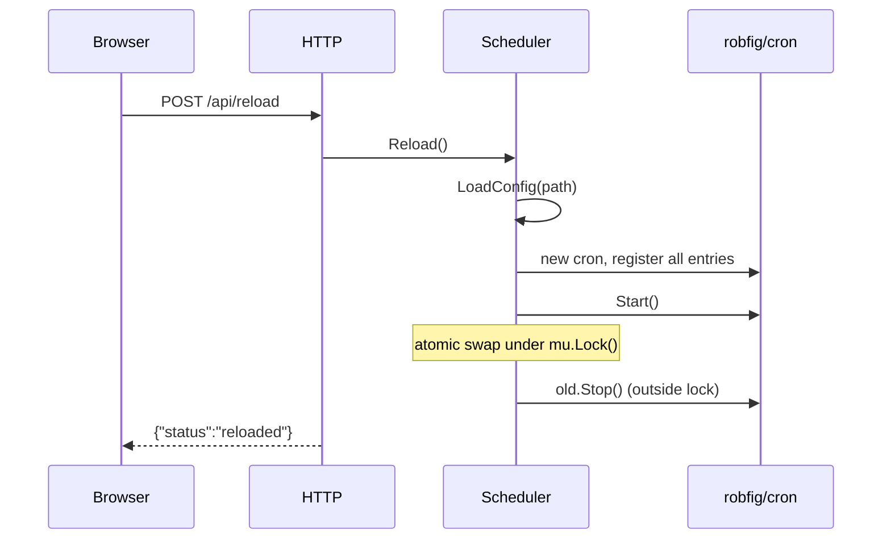
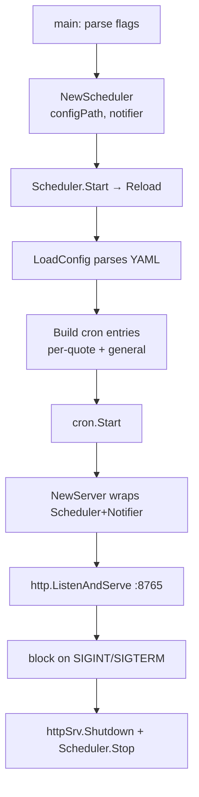

# Architecture

A single Go process hosts three collaborating pieces: a **Scheduler** running cron jobs, a **Notifier** that delegates to macOS notification tooling, and an **HTTP Server** that exposes a small embedded dashboard. State lives entirely in memory; the YAML file is the only persistence.

## Component diagram

## Fire-a-quote sequence

## Reload sequence

## Data flow at startup

## Design choices

- **In-process scheduler.** Avoids external dependencies; trivially restartable.
- **Atomic Reload.** A new `cron.Cron` is built and swapped under a mutex so in-flight HTTP requests never see a half-loaded state.
- **`cron.EntryID` lookup, not slice index.** `cron.Entries()` returns sorted by next-run, so we store IDs and look up `Next` per entry to keep UI mapping correct.
- **terminal-notifier preferred.** It supports `-open URL` for click-to-open; `osascript display notification` does not. Detection cached via `sync.Once`. When a quote has multiple `media` URLs, the notification opens the first; the dashboard lists all as numbered links.
- **Loopback only.** HTTP binds `127.0.0.1` by default — no auth, single-user laptop tool.
- **YAML is the only state.** Reload re-reads the file; no internal DB.
